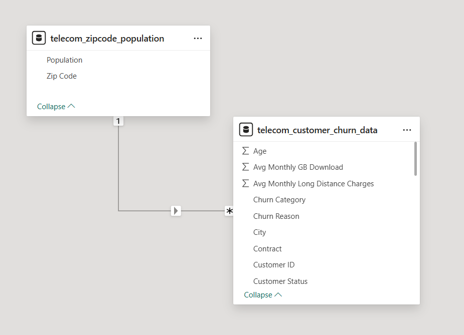
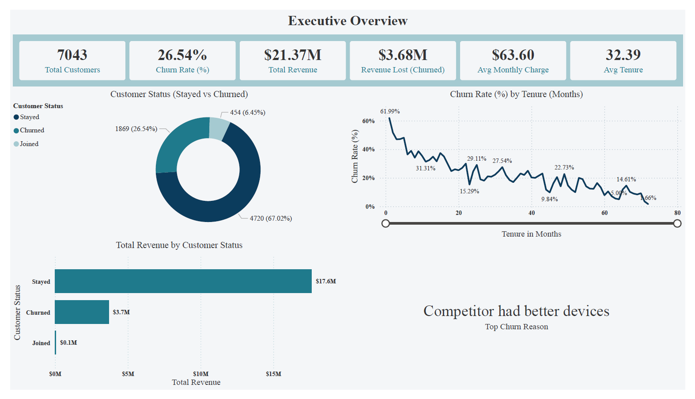
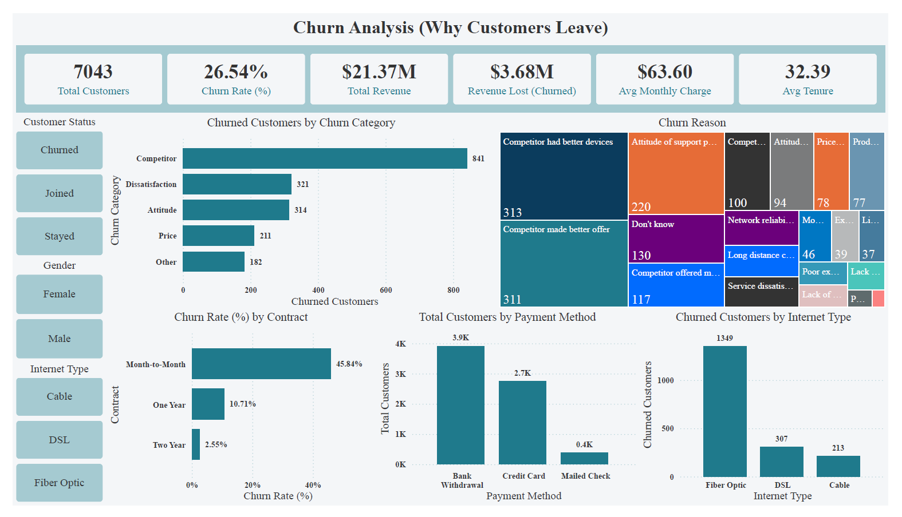
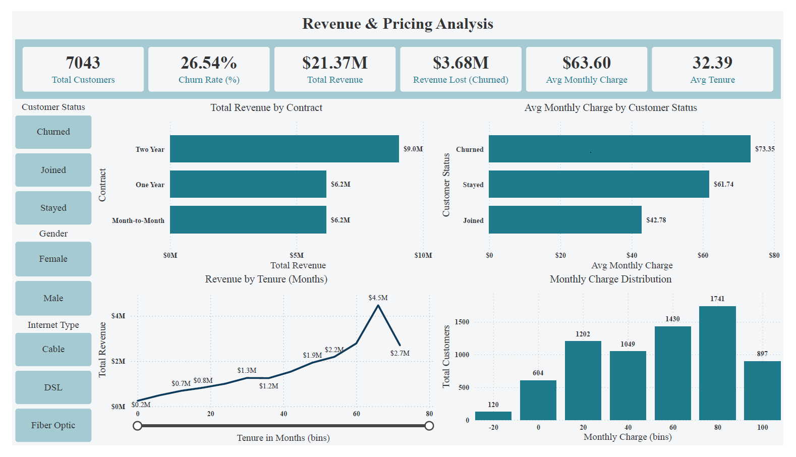

# 💡 Python & Power BI Project by Yash Yennewar

# 📊 Telecom Customer Churn Analysis
End-to-end Telecom Customer Churn Analysis using Python for data cleaning and Power BI for interactive dashboards to uncover churn drivers, revenue loss, and retention insights.

---

## 📖 Project Overview :
Customer churn is a major challenge in the telecom industry. This project analyzes customer data to understand **why customers leave**, identify **high-risk segments**, and measure the **financial impact of churn**.

The project follows a complete analytics workflow:
- **Python** for data cleaning and preprocessing
- **Power BI** for interactive dashboards and business insights

---

## 🔗 Project Link :

- [Telecom_Customer_Churn_Analysis](Telecom_Customer_Churn_Analysis.pbix)
- [Telecom_Customer_Churn_Analysis(Python)](Telecom_Customer_Churn_Analysis.ipynb)

---

## 🧩 Dataset Information :

- **Source:** [Telecom Customer Churn Dataset](https://mavenanalytics.io/data-playground/telecom-customer-churn)

---

## 🧩 Data Model :
The project uses a **star-schema-inspired relational model** optimized for Power BI performance.

 

---

## 🎯 Objectives :

- Calculate overall customer churn rate
- Identify top churn reasons
- Analyze churn by contract, tenure, payment method, and internet type
- Measure revenue lost due to churn
- Compare pricing behavior of churned vs retained customers

---

## 🛠 Tools & Technologies :

- **Python (Jupyter Notebook)**
  - Pandas
  - NumPy
  - Data Cleaning & Feature Engineering

- **Power BI**
  - Data Modeling
  - DAX Measures
  - Interactive Dashboards & Slicers

---

## 🧹 Data Cleaning & Preparation (Python) :

The dataset was first cleaned and prepared using Python to ensure high-quality data before visualization.
**Data Cleaning Steps:**
- Fixed encoding and formatting issues.
- Converted numeric columns (Avg Monthly Long Distance Charges,Avg Monthly GB Download).
- Standardized categorical columns (Offer, Multiple Lines, Internet Type, Online Security, Online Backup, Device Protection Plan, Premium Tech Support, Streaming TV, Streaming Movies, Streaming Music, Unlimited Data).

---

## 📐 DAX (Data Analysis Expressions) :
Some important DAX measures created for the analysis :
```
DAX -
Total Revenue = SUM(telecom_customer_churn_data[Total Revenue])
Total Customers = DISTINCTCOUNT(telecom_customer_churn_data[Customer ID])
Churned Customers = CALCULATE([Total Customers], telecom_customer_churn_data[Customer Status] = "Churned")
Active Customers = CALCULATE([Total Customers], telecom_customer_churn_data[Customer Status] = "Stayed")
Churn Rate (%) = DIVIDE([Churned Customers],[Total Customers],0)
Avg Tenure = AVERAGE(telecom_customer_churn_data[Tenure in Months])
Top Churn Reason = 
CALCULATE(
    SELECTEDVALUE(telecom_customer_churn_data[Churn Reason]),FILTER(ALL(telecom_customer_churn_data[Churn Reason]),[Churn Reason Rank] = 1)
)
```
 
---

## 📈 Dashboards Overview

### 1️⃣ Executive Overview
**KPIs**
- Total Customers: **7,043**
- Churn Rate: **26.54%**
- Total Revenue: **$21.37M**
- Revenue Lost (Churned): **$3.68M**
- Avg Monthly Charge: **$63.60**
- Avg Tenure: **32.39 months**

**Key Insights**
- Churn decreases significantly as customer tenure increases
- Early-tenure customers are most likely to churn
- Retained customers contribute the majority of revenue



---

### 2️⃣ Churn Analysis – Why Customers Leave
**Key Findings**
- Top Churn Category: **Competitor**
- Top Churn Reason: *Competitor had better devices*
- Month-to-month contracts show the highest churn rate (**45.84%**)
- Fiber Optic customers show the highest churn volume
- Bank Withdrawal payment method has higher churn exposure



---

### 3️⃣ Revenue & Pricing Analysis
**Insights**
- Two-year contracts generate the highest total revenue
- Churned customers pay a higher average monthly charge
- Revenue grows with tenure, peaking for long-term customers
- Higher monthly charges increase churn risk if value expectations are unmet



---

## 🧠 Key Business Insights :
- Long-term contracts significantly reduce churn
- Competitive pricing and better device offerings improve retention
- High-value customers require proactive engagement
- Early-stage customers need focused retention strategies

---

## 🚀 Skills Demonstrated :
- Data Cleaning & Preprocessing
- Exploratory Data Analysis (EDA)
- Power BI Data Modeling
- DAX Measures & KPIs
- Dashboard Design & Storytelling
- Business Insight Generation

---

## 📌 Use Cases :
- Telecom companies designing churn reduction strategies
- Data analysts showcasing real-world Power BI projects
- Business stakeholders understanding churn-driven revenue loss

---
